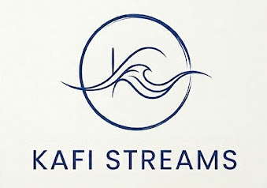
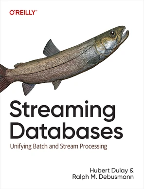

## Stream Processing, Strongly Consistent and 10x Easier

[*Kafi Streams*](docs/streams.ipynb) (formerly known as [*Kafi*](docs/kafi.ipynb)[^1]) is a Python library for stream processing created by the co-author of "Streaming Databases" (with Hubert Dulay) for O'Reilly, Ralph M. Debusmann.

Kafi Streams is technically based on Bruno Rucy's ingenious [*pydbsp*](https://github.com/brurucy/pydbsp), a pure Python implementation of the revolutionary [*DataBase Stream Processing* (*DBSP*)](https://arxiv.org/abs/2203.16684) theory by Mihai Budiu, Leonid Rhyzhyk et al. of Feldera (https://www.feldera.com/).

## [Now Streaming Is Going to Become Mainstream](https://ralphmdebusmann.substack.com/p/now-streaming-is-going-to-become)

Kafi Streams makes complex stateful stream processing 10x easier than before.

All the additional concepts and leaky abstractions (see this [blog post](https://ralphmdebusmann.substack.com/p/why-streaming-still-isnt-mainstream)) that have kept complex stateful stream processing in a niche for a handful of streaming/distributed systems experts are, all of a sudden, gone.

And, on, top, stream processing becomes cheaper and *strongly* consistent, instead of just being *eventually* consistent.

> **[Documentation](docs/streams.ipynb)**

## Presentations

Kafi Streams has already been presented at:
* [Current 2023 San Jose](https://www.confluent.io/events/current/2023/kash-py-how-to-make-your-data-scientists-love-real-time-1/)
* [Current 2024 Austin](https://current.confluent.io/2024-sessions/your-swiss-army-knife-for-kafka-based-applications) ([Jupyter notebook](https://github.com/xdgrulez/cur24))
* [Current 2025 Bangalore](https://current.confluent.io/post-conference-videos-2025/kafka-superpowers-for-your-jupyter-notebook-and-python-bng25) ([Jupyter notebook](https://github.com/xdgrulez/cur25blr)).
* [Berlin Buzzwords 2026](https://2026.berlinbuzzwords.de/session/kafi-streams-complex-stream-processing-made-simple/) ([Jupyter notebook](presentations/2026-06-09-Berlin_Buzzwords/bbuzz2026.ipynb))

## Licensing & Source-Available Terms

This software is licensed under the **Apache License 2.0 with the Human Source Addendum** (Version 0.4).

By accessing, cloning, or utilizing this repository, you agree to the terms set forth in the Addendum.

* **Safe Harbor (Developers & Standard Enterprises):** 100% FREE and unrestricted for all commercial applications, startups, individual engineers, and human developers (including internal usage of AI coding tools like Claude Code or Cursor).
* **Primary AI Infrastructure Providers (Exclusion Clause):** Unauthorized ingestion, model training, or utilization by hyperscalers or foundational AI developers with valuation/funding >$10B USD (e.g., OpenAI, Anthropic, Microsoft, Google, Meta, Nvidia, xAI) is strictly prohibited without a separate, bilaterally signed commercial agreement. Financial liability, asset disgorgement, and immediate injunctive relief apply.

For full legal terms, see [LICENSE](LICENSE) and [HUMAN-SOURCE-ADDENDUM](HUMAN-SOURCE-ADDENDUM).

---

[^1]: "Kafi" stands for "(Ka)fka and (fi)les". And, "Kafi" is the Swiss word for a coffee or a coffee place. *Kafi Streams* is the successor of [kash.py](https://github.com/xdgrulez/kash.py) which is the successor of [streampunk](https://github.com/xdgrulez/streampunk).
